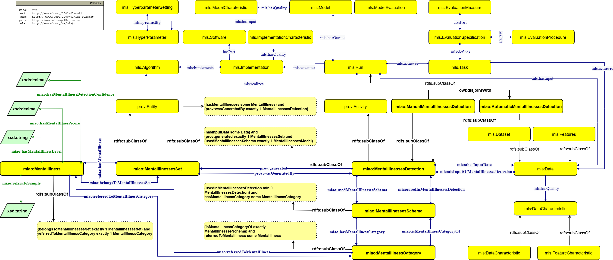

[![CC BY-SA 4.0][cc-by-sa-shield]][cc-by-sa]  

[cc-by-sa]: http://creativecommons.org/licenses/by-sa/4.0/
[cc-by-sa-shield]: https://img.shields.io/badge/License-CC%20BY--SA%204.0-lightgrey.svg

# MIAO: A Mental Illness Analysis Ontology for Detecting Mental Health Conditions

## Introduction

We introduce the Mental Illness Analysis Ontology (**MIAO**), an ontology designed to model the detection process of mental illness. MIAO has two key characteristics: (i) it provides a conceptual framework for the detection process, regardless of the detection method, allowing for both human and
AI-driven detection approaches, and (ii) it separates the detection process from the underlying mental illness model (e.g., ontology) used to represent mental health conditions, enabling the use of different mental illness models, depending
on the needs of the user or application. Two research questions guide our investigation and the development of the MIAO ontology:

- **RQ1**: How can the detection process of mental illness be effectively modeled in a way that is agnostic to the specific detection method used (human or AI)?
- **RQ2**: How can existing mental health models be integrated to support the detection process, ensuring compatibility across different detection systems and applications?
  

## Ontology Overview

MIAO integrates:
- PROV-O – provenance modeling
- MLS – machine learning concepts
- Dublin Core Terms – metadata
- VANN – namespace management

**Namespace URI:** `https://w3id.org/miao`  
**Preferred Prefix:** `miao`  
**Version:** 1.00 

## Classes

| Class | Description | Cardinalities / Restrictions |
|-------|-------------|------------------------------|
| **MentalIllnessesDetection** | Represents a mental illness detection process (manual or automatic) | Must have exactly 1 input schema (`usedMentalIllnessesSchema`) and generates exactly 1 `MentalIllnessesSet`; input data (`hasInputData`) can be ≥1 |
| **ManualMentalIllnessesDetection** | Detection performed manually by an expert | Subclass of `MentalIllnessesDetection` |
| **AutomaticMentalIllnessesDetection** | Detection performed automatically by a machine model | Subclass of `MentalIllnessesDetection` and `mls:Run` |
| **MentalIllness** | Detected or predicted mental illness | Belongs to exactly 1 `MentalIllnessesSet`; maps to exactly 1 `MentalIllnessCategory` (`referredToMentalIllnessCategory`) |
| **DisorderType** | Type of mental disorder | Subclass of `MentalIllness` |
| **MentalIllnessCategory** | Category defined in a schema | Refers to ≥1 `MentalIllness` (`referredToMentalIllness`) and belongs to exactly 1 `MentalIllnessesSchema` |
| **MentalIllnessesSchema** | Schema or model defining categories | Must have ≥1 `MentalIllnessCategory`; may be used in ≥0 `MentalIllnessesDetection` |
| **MentalIllnessesSet** | Set of detected mental illnesses | Contains ≥1 `MentalIllness`; generated by exactly 1 `MentalIllnessesDetection` |

## Object Properties

| Property | Domain → Range | Cardinalities / Restrictions | Description |
|----------|----------------|-----------------------------|-------------|
| `hasMentalIllness` | MentalIllnessesSet → MentalIllness | ≥1 MentalIllness per set | Connects a set to its mental illnesses |
| `belongsToMentalIllnessesSet` | MentalIllness → MentalIllnessesSet | Exactly 1 set per mental illness | Inverse of `hasMentalIllness` |
| `hasMentalIllnessCategory` | MentalIllnessesSchema → MentalIllnessCategory | ≥1 category per schema | Connects a mental health schema to its categories |
| `isMentalIllnessCategoryOf` | MentalIllnessCategory → MentalIllnessesSchema | Exactly 1 schema per category | Inverse of `hasMentalIllnessCategory` |
| `referredToMentalIllnessCategory` | MentalIllness → MentalIllnessCategory | Exactly 1 category per illness | Connect a mental illness to its schema category |
| `referredToMentalIllness` | MentalIllnessCategory → MentalIllness | Functional property | Inverse of `referredToMentalIllnessCategory` |
| `usedMentalIllnessesSchema` | MentalIllnessesDetection → MentalIllnessesSchema | Exactly 1 schema per detection | Schema used in detection |
| `usedInMentalIllnessesDetection` | MentalIllnessesSchema → MentalIllnessesDetection | ≥0 detections per schema | Inverse of `usedMentalIllnessesSchema` |
| `hasInputData` | MentalIllnessesDetection → MLS Data | ≥1 input | Input data for detection |
| `isInputOfMentalIllnessesDetection` | MLS Data → MentalIllnessesDetection| ≥1 Detection | Inverse of `isInputOfMentalIllnessesDetection` |
| `prov:generated` | MentalIllnessesDetection → MentalIllnessesSet | Exactly 1 set generated | Output of detection |
| `prov:wasGeneratedBy` | MentalIllnessesSet → MentalIllnessesDetection | Exactly 1 detection per set | Inverse of `prov:generated` |

## Data Properties

| Property | Domain | Range | Description |
|----------|--------|-------|-------------|
| `hasMentalIllnessDetectionConfidence` | MentalIllness | decimal | Confidence of detection (human or ML) |
| `hasMentalIllnessScore` | MentalIllness | decimal | Numeric intensity (0–1) |
| `hasMentalIllnessLevel` | MentalIllness | string | Categorical intensity (Low, Medium, High) |

---
## Validation

**OntOlogy Pitfall Scanner!**: [OOPS results](https://ida-fbk.github.io/mental-health-ontology/documentation/html-docs/OOPSevaluation/oopsEval)

## Authors
- Gianluca Apriceno: apriceno@fbk.eu
- Sergio Muñoz: sergio.munoz@upm.es
- Tania Bailoni: tbailoni@fbk.eu
- Mauro Dragoni: dragoni@fbk.eu
- Carlos Á. Iglesias: carlosangel.iglesias@upm.es

## License
This work is licensed under a
[Creative Commons Attribution-ShareAlike 4.0 International License][cc-by-sa].

[![CC BY-SA 4.0][cc-by-sa-image]][cc-by-sa]

[cc-by-sa-image]: https://licensebuttons.net/l/by-sa/4.0/88x31.png

