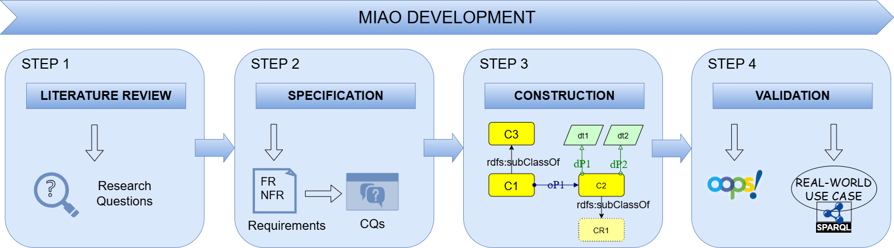
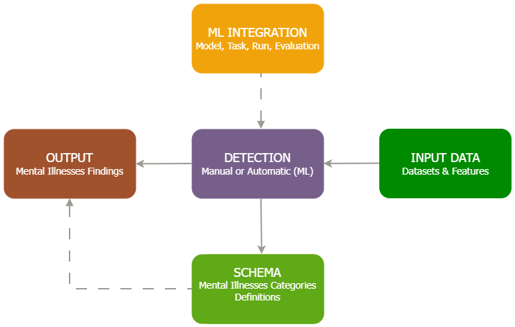
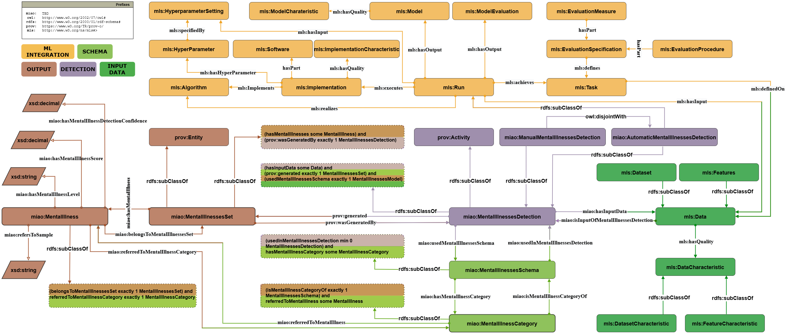

[![CC BY-SA 4.0][cc-by-sa-shield]][cc-by-sa]  

[cc-by-sa]: http://creativecommons.org/licenses/by-sa/4.0/
[cc-by-sa-shield]: https://img.shields.io/badge/License-CC%20BY--SA%204.0-lightgrey.svg

  

# MIAO: A Mental Illness Analysis Ontology for Detecting Mental Health Conditions

We introduce the Mental Illness Analysis Ontology (**MIAO**), an ontology designed to model the detection process of mental illness. MIAO has two key characteristics: (i) it provides a conceptual framework for the detection process, regardless of the detection method, allowing for both human and
AI-driven detection approaches, and (ii) it separates the detection process from the underlying mental illness model (e.g., ontology) used to represent mental health conditions, enabling the use of different mental illness models, depending
on the needs of the user or application. Two research questions guide our investigation and the development of the MIAO ontology:

- **RQ1**: How can the detection process of mental illness be effectively modeled in a way that is agnostic to the specific detection method used (human or AI)?
- **RQ2**: How can existing mental health models be integrated to support the detection process, ensuring compatibility across different detection systems and applications?
  
## Ontology Development

The development of the MIAO schema follows a 4-step procedure:
 1. **Domain analysis**
 
    The analysis of the domain of interest provides an overview of the state of the art, of the challenges, the strength and limitations
    of modelling mental illness, and especially the lack of models conceptualizing mental illness detection. The results have been reported in the previous section;
    this analysis also prompts the research questions (i.e., **RQ1** and **RQ2**) which guide our work.

2. **Specification**
     
   After reviewing the literature and formulating the research questions, we defined a set of functional (**FRs**) and non-functional
   (**NFRs**) requirements that the ontology should satisfy. These requirements provide guidance for the initial high-level conceptualization
   of the ontology. Based on these requirements, we also defined a set of
   competency questions (**CQs**) to further refine the scope and intended use of the
   ontology (see [REQs&CQs](https://github.com/IDA-FBK/mental-health-ontology/tree/main/reqs%26cqs)).

3. **Construction**
     
   The construction phase involves both the design andcformalization of the ontology. Starting from the CQs, we defined the concepts
   needed to model the mental illness detection domain. Also, in accordance with established best practices in ontology development, we prioritized reusing existing
   data models and vocabularies as a foundation, extending them to capturecdomain-specific classes and properties. Therefore, to express the concepts related
   to automatic detection models, we integrated [ML Schema](https://ml-schema.github.io/documentation/ML%20Schema.html), which is used to represent and interchange information on data mining and machine learning
   algorithms, datasets, and experiments. Subsequently, we designed the model
   merging the concepts defined in our domain with those present in ML Schema.
   After having finalized the model we formalized the ontology in Turtle TTL format
   with the Protégé tool.

4. **Validation**
     
     **OntOlogy Pitfall Scanner!**: [OOPS results](https://ida-fbk.github.io/mental-health-ontology/documentation/html-docs/OOPSevaluation/oopsEval)

## Ontology Overview

The MIAO ontology is structured into five interconnected modules The **Input Data** module describes the datasets and extracted features that serve as the basis for the analysis. The **Detection** module models the different detection processes supported by the ontology, distinguishing between assessments performed manually by clinicians or experts and those obtained automatically through computational methods. In the case of automatic approaches, the ontology integrates and reuses concepts from the **ML Integration** module, such as learning models, experimental runs, tasks, and evaluation procedures. The **Scheme** module represents the diagnostic or classification systems adopted during the analysis process (e.g., ICD-11), while the **Output** module captures the resulting mental illness predictions and their representation. The latter two modules are closely related, since each identified condition is associated with a category defined by the selected classification scheme.

MIAO integrates:
- PROV-O – provenance modeling
- MLS – machine learning concepts
- Dublin Core Terms – metadata
- VANN – namespace management

**Namespace URI:** `https://w3id.org/miao`  
**Preferred Prefix:** `miao`  
**Version:** 1.00 

### Classes

| Class | Description | Cardinalities / Restrictions |
|-------|-------------|------------------------------|
| **MentalIllnessesDetection** | Represents a mental illness detection process (manual or automatic) | Must have exactly 1 input schema (`usedMentalIllnessesSchema`) and generates exactly 1 `MentalIllnessesSet`; input data (`hasInputData`) can be ≥1 |
| **ManualMentalIllnessesDetection** | Detection performed manually by an expert | Subclass of `MentalIllnessesDetection` |
| **AutomaticMentalIllnessesDetection** | Detection performed automatically by a machine model | Subclass of `MentalIllnessesDetection` and `mls:Run` |
| **MentalIllness** | Detected or predicted mental illness | Belongs to exactly 1 `MentalIllnessesSet`; maps to exactly 1 `MentalIllnessCategory` (`referredToMentalIllnessCategory`) |
| **MentalIllnessCategory** | Category defined in a schema | Refers to ≥1 `MentalIllness` (`referredToMentalIllness`) and belongs to exactly 1 `MentalIllnessesSchema` |
| **MentalIllnessesSchema** | Schema or model defining categories | Must have ≥1 `MentalIllnessCategory`; may be used in ≥0 `MentalIllnessesDetection` |
| **MentalIllnessesSet** | Set of detected mental illnesses | Contains ≥1 `MentalIllness`; generated by exactly 1 `MentalIllnessesDetection` |

### Object Properties

| Property | Domain → Range | Cardinalities / Restrictions | Description |
|----------|----------------|-----------------------------|-------------|
| `hasMentalIllness` | MentalIllnessesSet → MentalIllness | ≥1 MentalIllness per set | Connects a set to its mental illnesses |
| `belongsToMentalIllnessesSet` | MentalIllness → MentalIllnessesSet | Exactly 1 set per mental illness | Inverse of `hasMentalIllness` |
| `hasMentalIllnessCategory` | MentalIllnessesSchema → MentalIllnessCategory | ≥1 category per schema | Connects a mental health schema to its categories |
| `isMentalIllnessCategoryOf` | MentalIllnessCategory → MentalIllnessesSchema | Exactly 1 schema per category | Inverse of `hasMentalIllnessCategory` |
| `referredToMentalIllnessCategory` | MentalIllness → MentalIllnessCategory | Exactly 1 category per illness | Connect a mental illness to its schema category |
| `referredToMentalIllness` | MentalIllnessCategory → MentalIllness | Functional property | Inverse of `referredToMentalIllnessCategory` |
| `usedMentalIllnessesSchema` | MentalIllnessesDetection → MentalIllnessesSchema | Exactly 1 schema per detection | Schema used in detection |
| `usedInMentalIllnessesDetection` | MentalIllnessesSchema → MentalIllnessesDetection | ≥0 detections per schema | Inverse of `usedMentalIllnessesSchema` |
| `hasInputData` | MentalIllnessesDetection → MLS Data | ≥1 input | Input data for detection |
| `isInputOfMentalIllnessesDetection` | MLS Data → MentalIllnessesDetection| ≥1 Detection | Inverse of `isInputOfMentalIllnessesDetection` |
| `prov:generated` | MentalIllnessesDetection → MentalIllnessesSet | Exactly 1 set generated | Output of detection |
| `prov:wasGeneratedBy` | MentalIllnessesSet → MentalIllnessesDetection | Exactly 1 detection per set | Inverse of `prov:generated` |

### Data Properties

| Property | Domain | Range | Description |
|----------|--------|-------|-------------|
| `refersToSample` | MentalIllness | string | Numerical identifier of the data sample on which one or more mental illnesses were detected|
| `hasMentalIllnessDetectionConfidence` | MentalIllness | decimal | Confidence of detection (human or ML) |
| `hasMentalIllnessScore` | MentalIllness | decimal | Numeric intensity (0–1) |
| `hasMentalIllnessLevel` | MentalIllness | string | Categorical intensity (Low, Medium, High) |

## Ontology Validation Case

To demonstrate the applicability of MIAO, we provide a real-world validation based on a published research study on detecting mental illnesses from social media using AI models. This case shows how MIAO can represent AI-based detection workflows, results, and evaluation metrics.  

The validation resources are available in the [validation-case](./validation-case) folder.

## 🚀 Google Colab Notebook

We have implemented a Python **Colab Notebook** showing how to interact with MIAO ontology by performing SPARQL queries based on the CQs of each REQ ([REQs&CQs](https://github.com/IDA-FBK/mental-health-ontology/tree/main/reqs%26cqs)). 

Click below to access the interactive notebook:

> **⚠️ Important**
> 
> To load and run the notebook correctly, please follow the instructions in the [README.md](https://github.com/IDA-FBK/mental-health-ontology/tree/main/notebook/README.md).

---
> [!NOTE]  
> - For more detailed information, please refer to the paper.
> - Two Turtle files showing how to model manual and automatic mental illness detection activities using MIAO are available [here](/examples/) (also used in the notebook).
> - Use Cases are available [here](/use-cases/)

## Authors
- Gianluca Apriceno: apriceno@fbk.eu
- Sergio Muñoz: sergio.munoz@upm.es
- Tania Bailoni: tbailoni@fbk.eu
- Mauro Dragoni: dragoni@fbk.eu
- Carlos Á. Iglesias: carlosangel.iglesias@upm.es

## License
This work is licensed under a
[Creative Commons Attribution-ShareAlike 4.0 International License][cc-by-sa].

[![CC BY-SA 4.0][cc-by-sa-image]][cc-by-sa]

[cc-by-sa-image]: https://licensebuttons.net/l/by-sa/4.0/88x31.png

