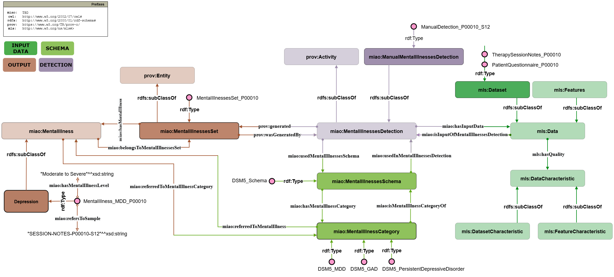

# Manual Detection Validation Case

The goal of this validation is to demonstrate the applicability of MIAO to a real-world manual mental illness detection scenario based on clinical assessment and diagnostic procedures performed by mental health professionals.

## Validation Study Overview

The validation is based on the standard diagnostic process of mental illness detection carried out by healthcare professionals (e.g., psychologists and psychiatrists), as described by established medical and psychiatric sources and literature ([Stein et al., 2022](https://doi.org/10.1002/wps.20998)).

The diagnostic process generally involves:

- Collection of patient-related clinical information through:
  - Clinical interviews
  - Psychological assessments
  - Therapy session notes
  - Specialized questionnaires
  - Symptom and cognitive evaluations

- Evaluation of collected information using established diagnostic schemas, including:
  - Diagnostic and Statistical Manual of Mental Disorders (**DSM-5**)
  - International Classification of Diseases (**ICD-11**)

The objective is to identify mental health conditions through expert evaluation and structured diagnostic criteria.

## Mapping to MIAO

The validation case contains a **complete semantic mapping of a manual mental illness detection process to MIAO**, representing how clinical data, diagnostic schemas, detected conditions, and diagnostic outcomes are modeled within the ontology. The figure above presents a **simplified view** of this mapping for clarity:

- Focuses on a single mental illness (**Major Depressive Disorder**)
- Uses a single type of clinical data (**therapy session notes**)
- Shows one diagnostic schema (**DSM-5**)
- Omits concepts not directly involved in the example (e.g., `AutomaticMentalIllnessesDetection` and machine learning-related concepts)

### Contents

- **`miao-manual-validation.ttl`**  
  A Turtle file containing the complete MIAO-based representation of the manual detection process, including:

  - Clinical datasets and their characteristics
  - Therapy session notes and psychological assessment data
  - Diagnostic processes modeled as instances of `miao:ManualMentalIllnessesDetection`
  - Diagnostic schemas (e.g., DSM-5)
  - Mental illness categories defined by the schema
  - Detection results represented as `miao:MentalIllnessesSet`
  - Diagnosed mental illnesses and their associated properties
  - Severity information and supporting evidence for the diagnosis

The TTL file includes all concepts and relations necessary to represent the manual diagnostic workflow and its outcomes.

### Modeling Assumptions

Since no specific healthcare institution or clinical software system is modeled, the validation assumes a generic diagnostic workflow based on common psychiatric assessment procedures and standard diagnostic schemas.

## Purpose and Reuse

This validation case demonstrates how MIAO can:

- represent manual mental illness detection workflows,
- preserve provenance and diagnostic information,
- model expert-based diagnostic decisions,
- support interoperability with healthcare and semantic web standards.

The provided resources can be reused as:

- an example for ontology evaluation,
- a template for modeling clinical diagnostic workflows,
- a basis for extending MIAO to additional healthcare scenarios or diagnostic schemas.

## References

[Stein et al., 2022] Stein, D.J., Shoptaw, S.J., Vigo, D.V., Lund, C., Cuijpers, P., Bantjes, J., Sartorius, N., Maj, M.: *Psychiatric diagnosis and treatment in the 21st century: paradigm shifts versus incremental integration*. World Psychiatry 21(3), 393–414 (2022). https://doi.org/10.1002/wps.20998